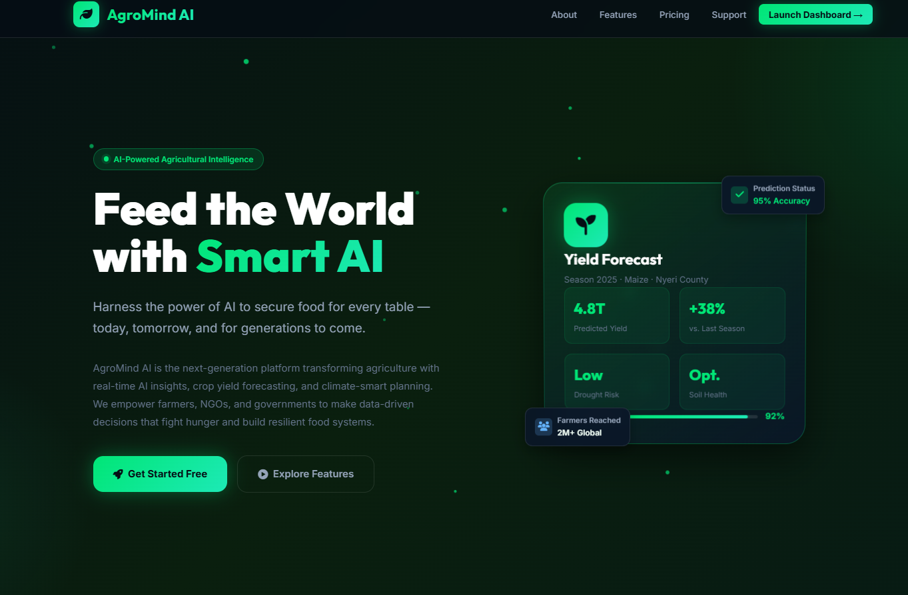
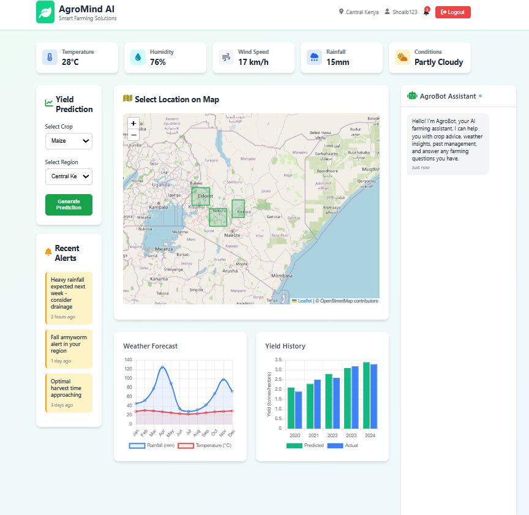
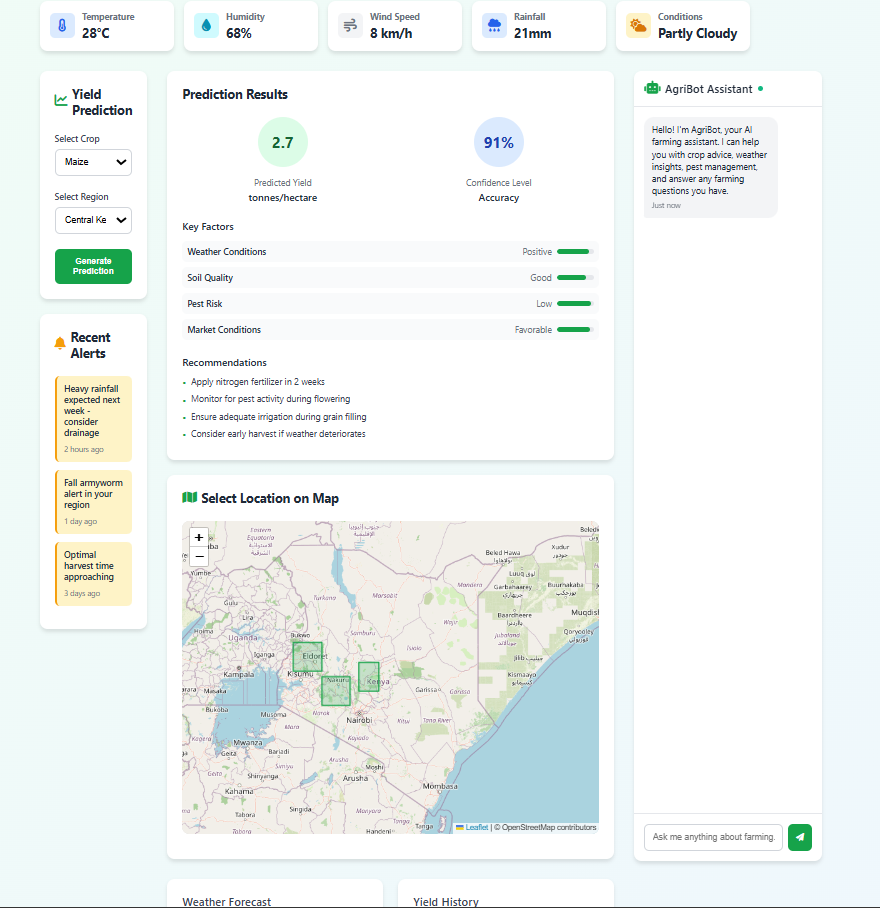

# 🌱 AgroMind AI — Predict. Empower. End Hunger.

> **Created by Shoaib Pasha**

---

## 📖 Introduction

**AgroMind AI** is a next-generation, AI-powered smart agriculture platform built to tackle one of humanity's greatest challenges — **food insecurity**. Aligned with the United Nations Sustainable Development Goal **SDG #2: Zero Hunger**, AgroMind AI empowers farmers, NGOs, and governments with real-time data, precision crop yield forecasting, climate-smart planning, and an intelligent farming assistant (AgriBot).

The platform combines a modern, interactive web frontend with a robust Node.js/Express backend API — offering features like:

- 🤖 **AI Crop Yield Prediction** — Forecast yields with up to 95% accuracy
- 🌦️ **Weather Integration** — Hyperlocal climate & weather data for smarter decisions
- 💬 **AgriBot Chat Assistant** — AI chatbot for real-time farming guidance
- 📊 **Interactive Dashboard** — Visualize historical yield data & trends
- 🔔 **Smart Notifications** — Alerts for pests, weather events, and harvest windows
- 🔒 **Secure Authentication** — JWT-based login with role management

---

## 🚀 How to Run

> ⚠️ **Important:** Make sure you `cd` into the correct folder first:
> ```
> cd "ZERO-HUNGER-main\ZERO-HUNGER-main"
> ```

### 1. Install Dependencies

```bash
npm install
```

### 2. Start the Backend Server

```bash
node server.js
```

> The server runs on **http://localhost:3001**

### 3. Open the Frontend

Open `index.html` in your browser directly, or serve it with:

```bash
npx serve .
```

Then visit **http://localhost:3000** (or the port shown in terminal).

### 4. (Optional) Run with Auto-Restart

```bash
npm run dev
```

---

## 🔑 Default Login Credentials

| Role   | Email                    | Password     |
|--------|--------------------------|--------------|
| Farmer | farmer@example.com       | password123  |
| Admin  | admin@agripredict.com    | admin123     |

---

## 📁 Project Structure

```
ZERO-HUNGER-main/
├── index.html              # Landing page
├── main.html               # Dashboard
├── landing_styles.css      # Landing page styles
├── styles.css              # Dashboard styles
├── server.js               # Node.js/Express backend API
├── package.json            # Project dependencies
├── CropYieldPredictor.jsx  # React crop predictor component
├── CROP_YIELD_PREDICTOR.ipynb  # Jupyter notebook (ML model)
├── Smart_Farming_Crop_Yield_2024.csv  # Dataset
└── .env                    # Environment variables
```
## 📸 **Project Images**

### 🛠️ **Home Page**
  

### 🚀 **Dashboard Interface 1**
  

### 🔥 **Dashboard Interface 2**
  


## 👤 Author

**Shoaib Pasha**
Built with ❤️ to support sustainable agriculture and end global hunger.


*© 2026 AgroMind AI. All rights reserved.*
